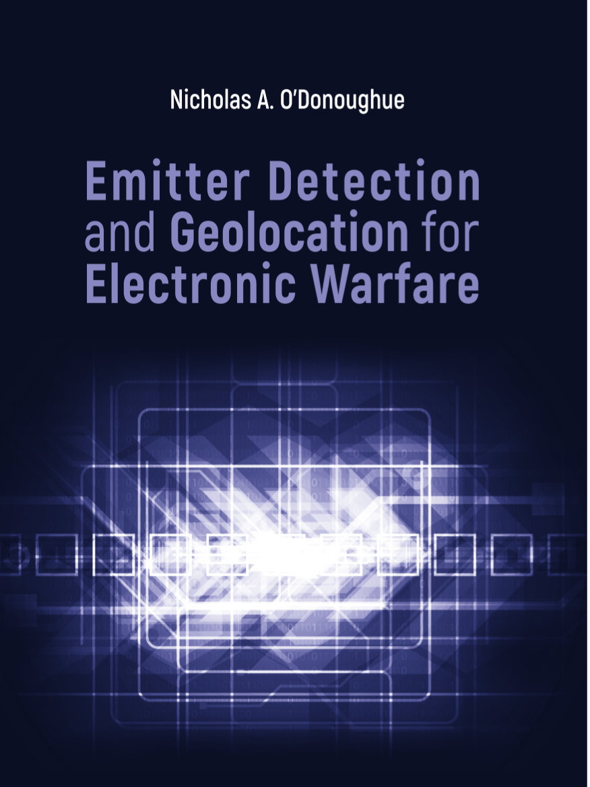
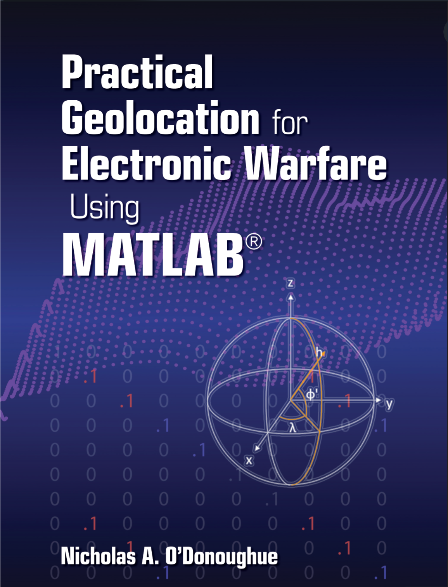

# Python Companion to Emitter Detection and Geolocation for Electronic Warfare



This repository is a port of the [MATLAB software companion](https://github.com/nodonoughue/emitter-detection-book/) to *Emitter Detection and Geolocation for Electronic Warfare,* by Nicholas A. O'Donoughue, Artech House, 2019.

This repository contains the Python code, released under the MIT License, and when it is complete, it will generate all the figures and implements all the algorithms and many of the performance calculations within the texts *Emitter Detection and Geolocation for Electronic Warfare,* by Nicholas A. O'Donoughue, Artech House, 2019 and *Practical Geolocation for Electronic Warfare using MATLAB,* by Nicholas A. O'Donoughue, Artech House, 2022.

The textbooks can be purchased from Artech House directly at the following links: **[Emitter Detection and Geolocation for Electronic Warfare](https://us.artechhouse.com/Emitter-Detection-and-Geolocation-for-Electronic-Warfare-P2291.aspx)**, and **[Practical Geolocation for Electronic Warfare using MATLAB](https://us.artechhouse.com/Practical-Geolocation-for-Electronic-Warfare-Using-MATLAB-P2292.aspx)** Both are also available from Amazon.

## Installation

### PyPI Install (recommended)
Use pip to install the package from the PyPI repository
```
pip install ewgeo
```

All the tools will be installed and available by importing the `ewgeo` package.
```
import ewgeo
```

### Local Install
After cloning or downloading the git repository, you can install it locally in any virtual environment.

If the path to your downloaded copy of the repository is `<PATH_TO_EWGEO>`, then issue the following commands in a terminal window.
```
cd <PATH_TO_EWGEO>
python3 -m venv .venv
source .venv/bin/activate
python3 -m pip install -e .
```

This repository has been tested with Python 3.12 and 3.13. We recommend using a 
virtual environment for package/dependency handling (the virtual environment 
does not need to be named `.venv`, however).

### Dependencies

This repository is dependent on the following packages, and was written with Python 3.12.
+ matplotlib
+ numpy
+ scipy
+ seaborn

## Figures
The **make_figures/** folder contains the code to generate all the figures in the textbook. The subfolder **make_figures/practical_geo** generates figures for the second textbook.

To generate all figures, run the file **make_figures.py**. To run figures for an individual chapter, use a command such as the following:
```python
import make_figures
chap1_figs = make_figures.chapter1.make_all_figures()
```

## Examples
The **examples/** folder contains the code to execute each of the examples in the textbook. The subfolder **examples/practical_geo** has examples from the second textbook.

## Utilities
A number of utilities are provided in this repository, under the following modules:

+ **ewgeo.aoa** Code to execute angle-of-arrival estimation, as discussed in Chapter 7
+ **ewgeo.array_df** Code to execute array-based direction-finding and angle-of-arrival estimation, as discussed in Chapter 8
+ **ewgeo.atm** Code to model atmospheric loss, as discussed in Appendix C
+ **ewgeo.detector** Code to model detection performance, as discussed in Chapter 3-4
+ **ewgeo.fdoa** Code to execute Frequency Difference of Arrival (FDOA) geolocation processing, as discussed in Chapter 12.
+ **ewgeo.hybrid** Code to execute hybrid geolocation processing, as discussed in Chapter 13.
+ **ewgeo.noise** Code to model noise power, as discussed in Appendix D.
+ **ewgeo.prop** Code to model propagation losses, as discussed in Appendix B.
+ **ewgeo.tdoa** Code to execute Time Difference of Arrival (TDOA) geolocation processing, as discussed in Chapter 11.
+ **ewgeo.triang** Code to model triangulation from multiple AOA measurements, as discussed in Chapter 10.
+ **ewgeo.tracker** Code to track emitter position over time using a Kalman filter, as discussed in Chapter 9.
+ **ewgeo.utils** Generic utilities, including numerical solvers used in geolocation algorithms.

## Feedback
Please submit any suggestions, bugs, or comments as issues in this git repository.
